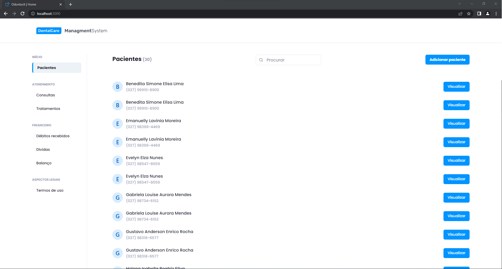
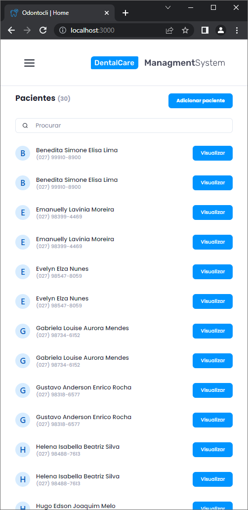
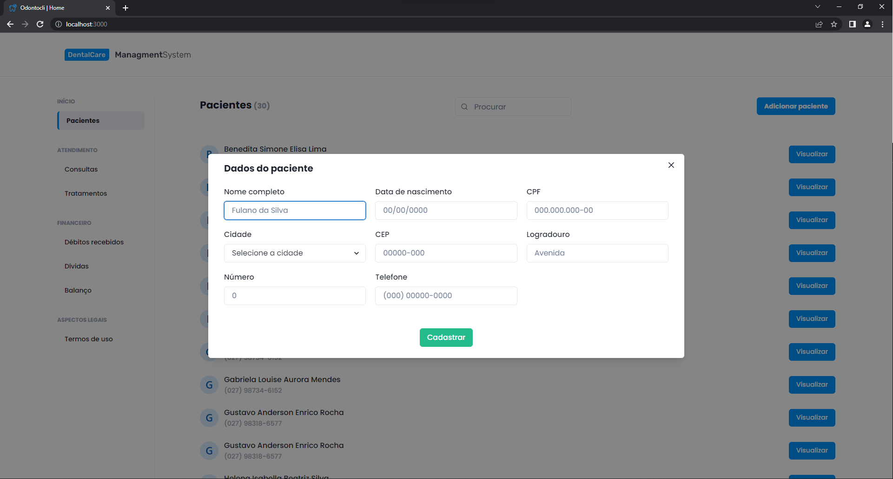
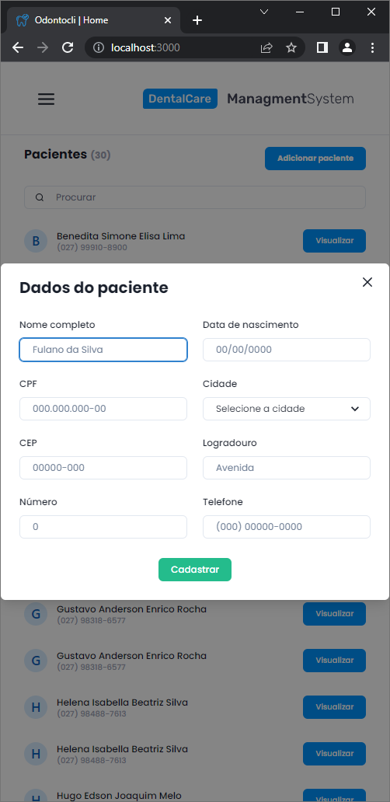

# ODONTOCLI - Front-End

Esse repositório consiste no Front-end do projeto ODONTOCLI, desenvolvido como trabalho final da disciplina de Gerência de Projetos de Software.

<div align='center'><h2>Home</h2></div>
<div align='center'>
  
  
</div>

## Modal de paciente
<div align='center'>
  
  
</div>

## Recursos utilizados

- Javascript
- Typescript
- NextJS
- ReactJS
- Axios
- Chakra UI
- Formik
- Yup

## Iniciando

Primeiramente, execute a aplicação back-end do projeto seguindo os passos descritos no repositório https://github.com/andradearthurf/back-end-odontocli.git

Para abrir a aplicação web em modo desenvolvedor execute o seguinte comando:
  ```bash
  yarn dev
  ```
Abra [http://localhost:3000](http://localhost:3000) no seu navegador para ver o resultado.
